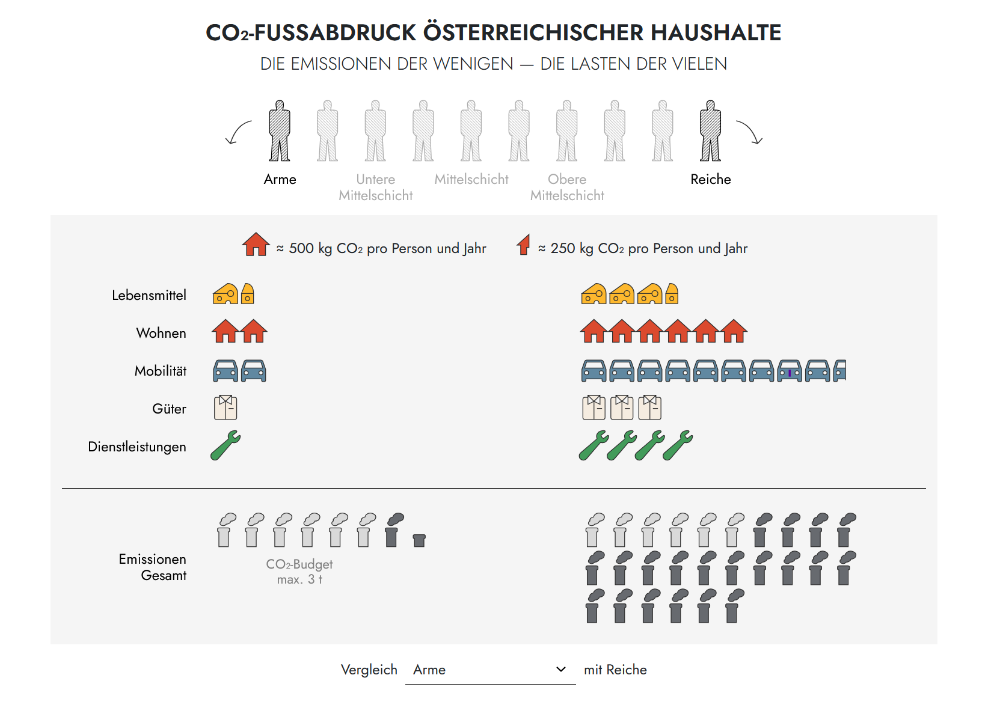

# CO₂ FOOTPRINT OF AUSTRIAN HOUSEHOLDS

## Submission for the Marie Neurath Prize for Data Visualization

This visualization makes the distributional injustice of CO₂ emissions visible: in Austria, the richest income decile causes four times as many emissions as the poorest. The isotype representation shows at a glance how drastically the differences between rich and poor diverge across consumption categories – from food and mobility to goods.

**View live:** <https://data-science.wifo.ac.at/emissionen-ungleichheit/>

## About the Project

The visualization is based on the study "Income distribution, consumption expenditure and household CO2 emissions in Austria" and applies Marie Neurath's isotype principle to make complex economic and ecological relationships accessible to a broad audience. Each symbol represents one tonne of CO₂ – the differing quantities immediately convey the scale of inequality.

### Key Findings

-   The richest income decile causes 4x more CO₂ emissions than the poorest
-   Gaps are particularly large in mobility and goods consumption
-   Lower-income households would be disproportionately burdened by carbon pricing
-   Effective climate policy must incorporate social justice

## Technical Implementation

-   **Framework:** Quarto
-   **Visualization:** Observable Plot with Vega-Lite
-   **Data source:** Dorninger et al. (2025)
-   **Typography:** Jost (body text), Lexend (headings)

## Data Source

Dorninger, C., Gingrich, S., Haas, W., Brad, A., Schneider, E., & Wiedenhofer, D. (2025). Slow and unequal reduction in Austrian household GHG footprints between 2000 and 2020. *Journal of Industrial Ecology*, 29(5), 1651–1665. https://doi.org/10.1111/jiec.70074

## Marie Neurath Prize

The Marie Neurath Prize for Data Visualization is awarded in 2025 by the Vienna Chamber of Labour (Arbeiterkammer Wien). It recognizes visualizations that make questions of distribution accessible to a broad audience and render complex economic and social relationships visible.

**More information:** <https://wien.arbeiterkammer.at/neurath>

**Created by:** Lukas Schmoigl[^1]  & Fabian Kalleitner[^2]

[^1]  **Organisation:** [WIFO – Austrian Institute of Economic Research](https://www.wifo.ac.at/) **Contact:** [lukas.schmoigl\@wifo.ac.at](mailto:lukas.schmoigl@wifo.ac.at)

[^2] **Organisation:** [LMU Munich – Department of Sociology](https://www.soziologie.lmu.de/en/) **Contact:** [fabian.kalleitner\@lmu.de](mailto:fabian.kalleitner@lmu.de)
